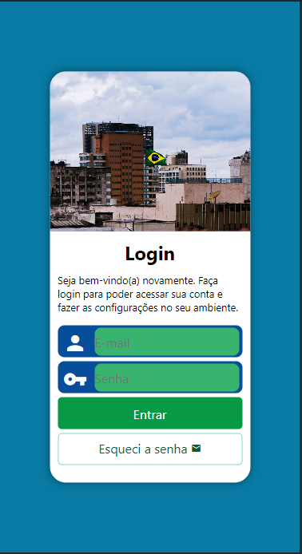
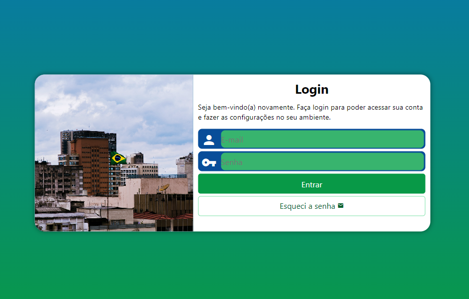
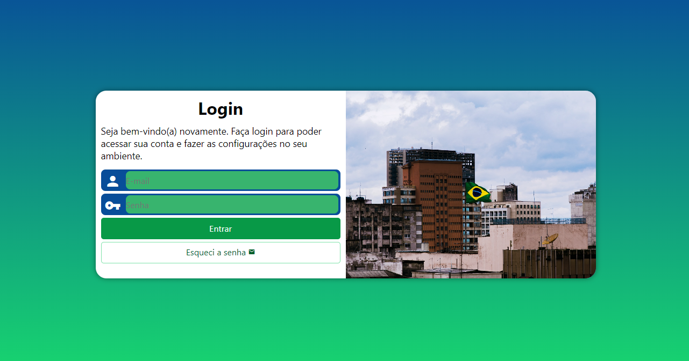

<h1 align="center"><strong>Projeto-Login</strong><h1>

    

  

# **Sobre o Projeto**
<strong>Projeto-Login</strong> disponibilizado por [Curso em vídeo](https://www.youtube.com/@CursoemVideo) feito utilizando responsividade, position, mobile first.    
  

# **Tecnologias**
* [HTML](https://developer.mozilla.org/pt-BR/docs/Web/HTML) 
* [CSS](https://developer.mozilla.org/pt-BR/docs/Web/CSS)  

# **Status**
</img>  

# **Licença**
 </img>  

# **Autor**
<a href="https://www.linkedin.com/in/pedrohalves/">
    </img>
LinkedIn</a>  

# **Disponível**
Clique <a href="https://pedrohenriquealvesfernandes.github.io/projeto-login/" style="color: cyan"><strong>AQUI</strong></a> para acessar a projeto em funcionamento (resolução a ser exibida 1366px (desktop), 768px (tablet) e 375px (celular) ).

